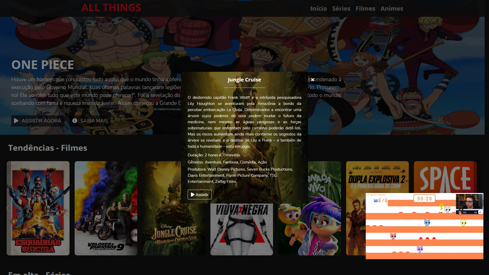

# Desafio: Recriando a Interface doa Netflix :tv: ​

Olá! Bem vindo ao desafios "Recriando a Interface da Netflix" feito no Bootcamp da plataforma [Digital Innovation One](https://digitalinnovation.one/).  :wave:

Nete projeto, utilizei tecnologias de HTML, CSS, JS, além da API disponibilizada pela The Movie Database, para uma melhor seleção de filmes e séries.
Foi testado no Chrome Versão 92.0.4515.131 e Microsoft Edge Versão 92.0.902.67. Firefox Versão 91.0 acontece alguns bugs, mas não interfere na funcionalidade.

##### Imagens

## O Desafio

Recrie a interface do principal site de streaming mundial utilizando  tecnologias simples como HTML5, CSS3 e JavaScript. 

##### Aprendizado

Nesse projeto você  aprenderá: como estruturar um layout, técnicas de CSS3 com containers e  variáveis, como posicionar os elementos com Flexbox e como utilizar  plugins Jquery a favor da sua aplicação.

## Ajudas Utilizadas

https://stackoverflow.com/questions/20007610/bootstrap-carousel-multiple-frames-at-once

https://www.codeply.com/p/0CWffz76Q9

https://fontawesome.com/

https://getbootstrap.com/

https://developers.themoviedb.org/3/

https://github.com/Matpires02/Netflix-dio

https://fonts.google.com/

